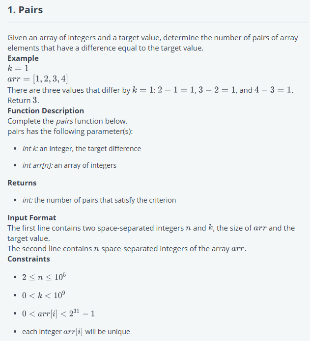
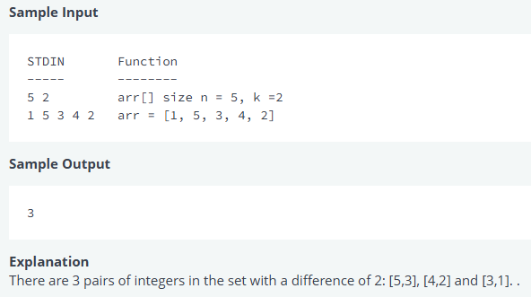

# Pairs

## Problem



## Solution
```
#!/bin/python3

import math
import os
import random
import re
import sys


#
# Complete the 'pairs' function below.
#
# The function is expected to return an INTEGER.
# The function accepts following parameters:
#  1. INTEGER k
#  2. INTEGER_ARRAY arr
#

def pairs(k, arr):
    # Write your code here
    total_pairs = 0
    visited_elements = dict()

    for number in arr:
        if number - k in visited_elements:
            total_pairs += 1

        if number + k in visited_elements:
            total_pairs += 1
        
        visited_elements[number] = True

    return total_pairs

if __name__ == '__main__':
    fptr = open(os.environ['OUTPUT_PATH'], 'w')

    first_multiple_input = input().rstrip().split()

    n = int(first_multiple_input[0])

    k = int(first_multiple_input[1])

    arr = list(map(int, input().rstrip().split()))

    result = pairs(k, arr)

    fptr.write(str(result) + '\n')

    fptr.close()
```