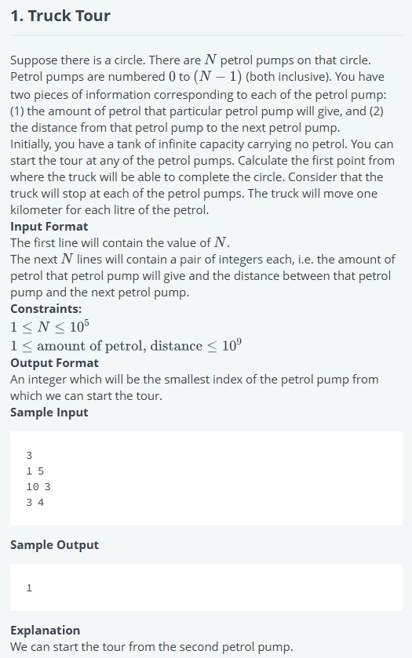

# Truck Tour

## Problem


## Solution
```
'use strict';

import { WriteStream, createWriteStream } from "fs";
process.stdin.resume();
process.stdin.setEncoding('utf-8');

let inputString: string = '';
let inputLines: string[] = [];
let currentLine: number = 0;

process.stdin.on('data', function(inputStdin: string): void {
    inputString += inputStdin;
});

process.stdin.on('end', function(): void {
    inputLines = inputString.split('\n');
    inputString = '';

    main();
});

function readLine(): string {
    return inputLines[currentLine++];
}


/*
 * Complete the 'truckTour' function below.
 *
 * The function is expected to return an INTEGER.
 * The function accepts 2D_INTEGER_ARRAY petrolpumps as parameter.
 */

function truckTour(petrolpumps: number[][]): number {
    // Write your code here
    let total = 0;
    let tank = 0;
    let start = 0;

    for (let i = 0; i < petrolpumps.length; i++) {
        const [petrol, distance] = petrolpumps[i];
        const balance = petrol - distance;

        tank += balance;
        total += balance;

        if (tank < 0) {
            // If tank goes negative, current start point is invalid
            start = i + 1;
            tank = 0;
        }
    }

    return total >= 0 ? start : -1;
}
function main() {
    const ws: WriteStream = createWriteStream(process.env['OUTPUT_PATH']);

    const n: number = parseInt(readLine().trim(), 10);

    let petrolpumps: number[][] = Array(n);

    for (let i: number = 0; i < n; i++) {
        petrolpumps[i] = readLine().replace(/\s+$/g, '').split(' ').map(petrolpumpsTemp => parseInt(petrolpumpsTemp, 10));
    }

    const result: number = truckTour(petrolpumps);

    ws.write(result + '\n');

    ws.end();
}
```