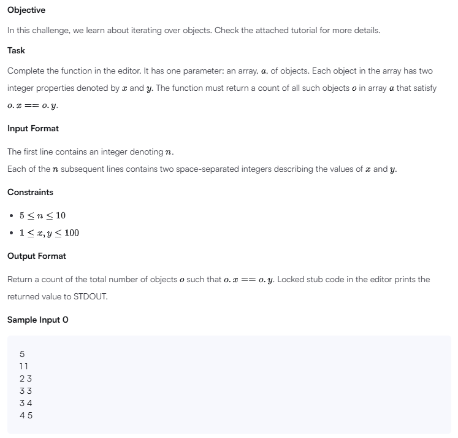

# Count Objects

## Problem


## Solution
```
'use strict';

process.stdin.resume();
process.stdin.setEncoding('utf-8');

let inputString = '';
let currentLine = 0;

process.stdin.on('data', inputStdin => {
    inputString += inputStdin;
});

process.stdin.on('end', _ => {
    inputString = inputString.trim().split('\n').map(string => {
        return string.trim();
    });
    
    main();    
});

function readLine() {
    return inputString[currentLine++];
}

/*
 * Return a count of the total number of objects 'o' satisfying o.x == o.y.
 * 
 * Parameter(s):
 * objects: an array of objects with integer properties 'x' and 'y'
 */
function getCount(objects) {
    let count = 0;
    for (let obj of objects) {
        if (obj.x === obj.y) {
            count++;
        }
    }
    return count;
}


function main() {
    const n = +(readLine());
    let objects = [];
    
    for (let i = 0; i < n; i++) {
        const [a, b] = readLine().split(' ');
        
        objects.push({x: +(a), y: +(b)});
    }
    
    console.log(getCount(objects));
}
```