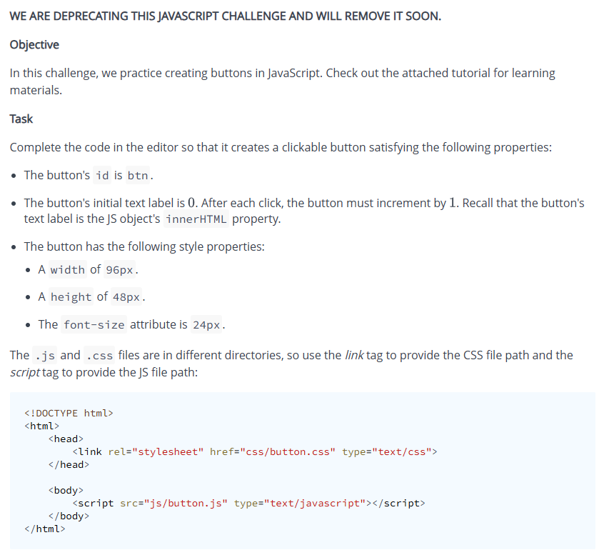
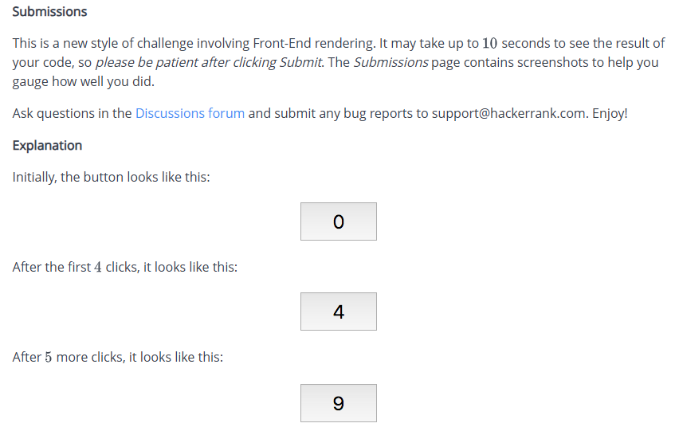

# Create a Button

## Problem



## Solution

## index.html
```
<!DOCTYPE html>
<html>
  <head>
    <link rel="stylesheet" href="css/button.css" type="text/css">
  </head>
  <body>
    <button id="btn"></button>
    <script src="js/button.js" type="text/javascript"></script>
  </body>
</html>
```

## css/button.css
```
#btn {
  width: 96px;
  height: 48px;
  font-size: 24px;
}
```

## js/button.js
```
 document.addEventListener("DOMContentLoaded", function () {
  const button = document.getElementById("btn");
  button.innerHTML = 0;
  button.onclick = function () {
    button.innerHTML = parseInt(button.innerHTML) + 1;
  };
});
```