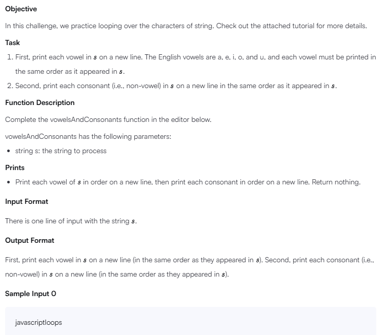

# Loops

## Problem


## Solution
```
'use strict';

process.stdin.resume();
process.stdin.setEncoding('utf-8');

let inputString = '';
let currentLine = 0;

process.stdin.on('data', inputStdin => {
    inputString += inputStdin;
});

process.stdin.on('end', _ => {
    inputString = inputString.trim().split('\n').map(string => {
        return string.trim();
    });
    
    main();    
});

function readLine() {
    return inputString[currentLine++];
}

/*
 * Complete the vowelsAndConsonants function.
 * Print your output using 'console.log()'.
 */
function vowelsAndConsonants(s) {
    const vowels = ['a', 'e', 'i', 'o', 'u'];
    let consonants = [];

    for (let char of s) {
        if (vowels.includes(char)) {
            console.log(char);
        } else {
            consonants.push(char);
        }
    }

    for (let char of consonants) {
        console.log(char);
    }
}


function main() {
    const s = readLine();
    
    vowelsAndConsonants(s);
}
```