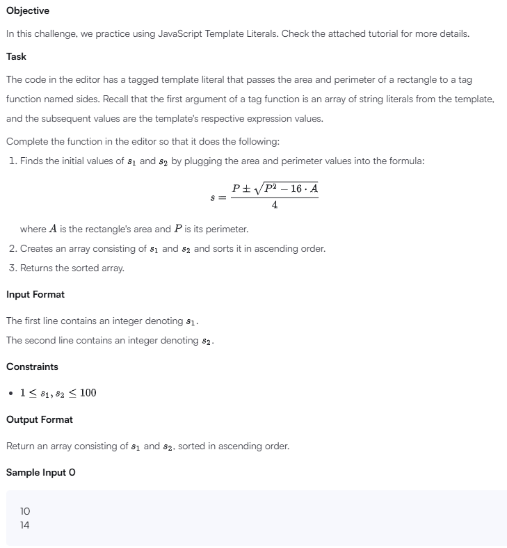
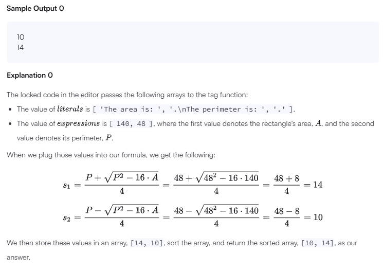

# Template Literals

## Problem



## Solution
```
'use strict';

process.stdin.resume();
process.stdin.setEncoding('utf-8');

let inputString = '';
let currentLine = 0;

process.stdin.on('data', inputStdin => {
    inputString += inputStdin;
});

process.stdin.on('end', _ => {
    inputString = inputString.trim().split('\n').map(string => {
        return string.trim();
    });
    
    main();    
});

function readLine() {
    return inputString[currentLine++];
}

/*
 * Determine the original side lengths and return an array:
 * - The first element is the length of the shorter side
 * - The second element is the length of the longer side
 * 
 * Parameter(s):
 * literals: The tagged template literal's array of strings.
 * expressions: The tagged template literal's array of expression values (i.e., [area, perimeter]).
 */
function sides(literals, ...expressions) {
    const [area, perimeter] = expressions;
    const s1 = (perimeter + Math.sqrt(perimeter * perimeter - 16 * area)) / 4;
    const s2 = (perimeter - Math.sqrt(perimeter * perimeter - 16 * area)) / 4;
    return [Math.min(s1, s2), Math.max(s1, s2)];
}


function main() {
    let s1 = +(readLine());
    let s2 = +(readLine());
    
    [s1, s2] = [s1, s2].sort();
    
    const [x, y] = sides`The area is: ${s1 * s2}.\nThe perimeter is: ${2 * (s1 + s2)}.`;
    
    console.log((s1 === x) ? s1 : -1);
    console.log((s2 === y) ? s2 : -1);
}
```