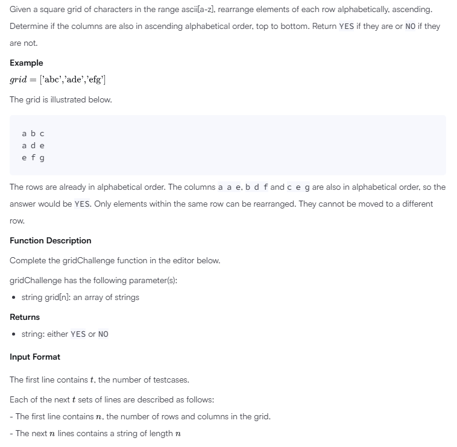
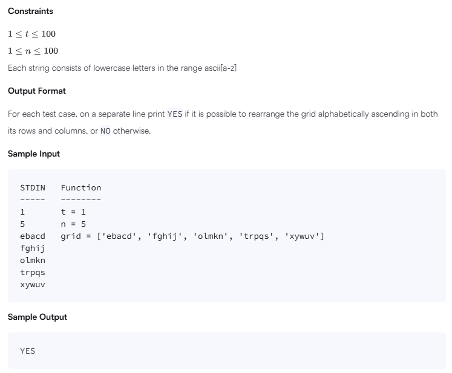
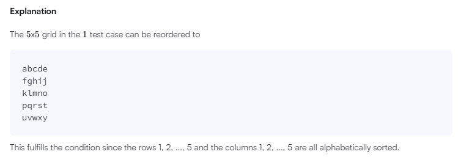

# Grid Challenge

## Problem




## Solution
```
'use strict';

import { WriteStream, createWriteStream } from "fs";
process.stdin.resume();
process.stdin.setEncoding('utf-8');

let inputString: string = '';
let inputLines: string[] = [];
let currentLine: number = 0;

process.stdin.on('data', function(inputStdin: string): void {
    inputString += inputStdin;
});

process.stdin.on('end', function(): void {
    inputLines = inputString.split('\n');
    inputString = '';

    main();
});

function readLine(): string {
    return inputLines[currentLine++];
}

/*
 * Complete the 'gridChallenge' function below.
 *
 * The function is expected to return a STRING.
 * The function accepts STRING_ARRAY grid as parameter.
 */

function gridChallenge(grid: string[]): string {
    // Write your code here
    // Step 1: Sort each row alphabetically
    const sortedGrid = grid.map(row => row.split('').sort().join(''));

    // Step 2: Check columns are in ascending order
    const n = sortedGrid.length;
    const m = sortedGrid[0].length;

    for (let col = 0; col < m; col++) {
        for (let row = 0; row < n - 1; row++) {
            if (sortedGrid[row][col] > sortedGrid[row + 1][col]) {
                return "NO";
            }
        }
    }

    return "YES";
}

function main() {
    const ws: WriteStream = createWriteStream(process.env['OUTPUT_PATH']);

    const t: number = parseInt(readLine().trim(), 10);

    for (let tItr: number = 0; tItr < t; tItr++) {
        const n: number = parseInt(readLine().trim(), 10);

        let grid: string[] = [];

        for (let i: number = 0; i < n; i++) {
            const gridItem: string = readLine();
            grid.push(gridItem);
        }

        const result: string = gridChallenge(grid);

        ws.write(result + '\n');
    }

    ws.end();
}
```