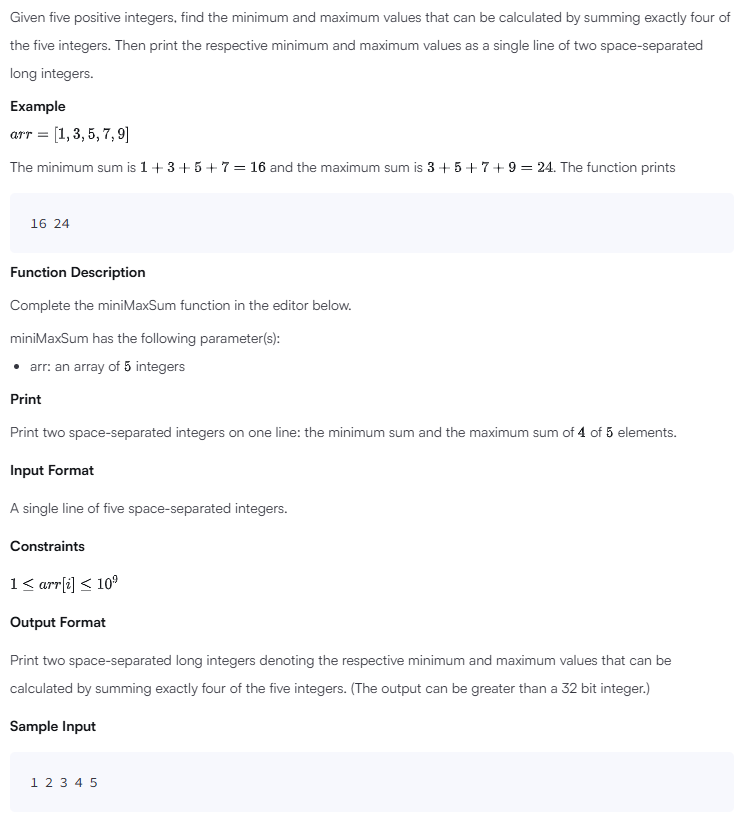
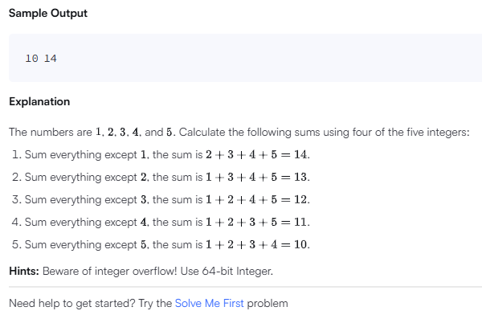

# Min-Max Sum

## Problem



## Solution
```
'use strict';

process.stdin.resume();
process.stdin.setEncoding('utf-8');

let inputString: string = '';
let inputLines: string[] = [];
let currentLine: number = 0;

process.stdin.on('data', function(inputStdin: string): void {
    inputString += inputStdin;
});

process.stdin.on('end', function(): void {
    inputLines = inputString.split('\n');
    inputString = '';

    main();
});

function readLine(): string {
    return inputLines[currentLine++];
}

/*
 * Complete the 'miniMaxSum' function below.
 *
 * The function accepts INTEGER_ARRAY arr as parameter.
 */

function miniMaxSum(arr: number[]): void {
    // Write your code here
    const total = arr.reduce((sum, num) => sum + num, 0);
    const min = Math.min(...arr);
    const max = Math.max(...arr);
    const minSum = total - max;
    const maxSum = total - min;
    console.log(`${minSum} ${maxSum}`);
}

function main() {

    const arr: number[] = readLine().replace(/\s+$/g, '').split(' ').map(arrTemp => parseInt(arrTemp, 10));

    miniMaxSum(arr);
}
```