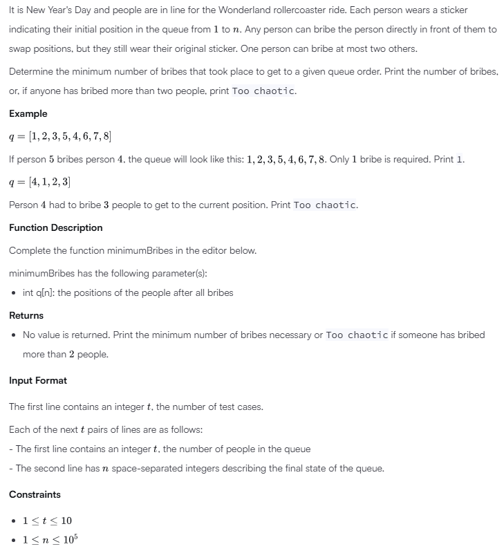
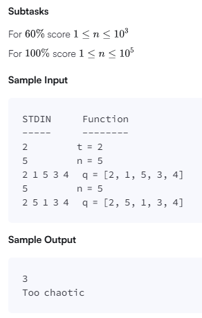
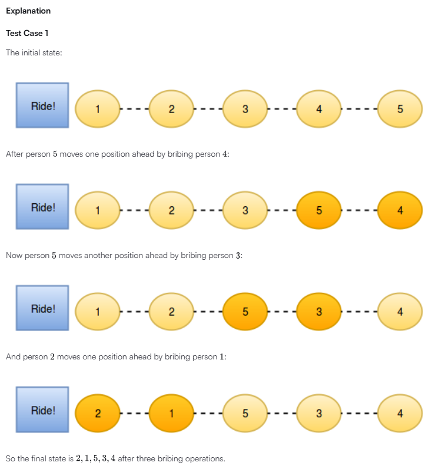
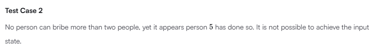

# New Year Chaos

## Problem





## Solution
```
'use strict';

process.stdin.resume();
process.stdin.setEncoding('utf-8');

let inputString: string = '';
let inputLines: string[] = [];
let currentLine: number = 0;

process.stdin.on('data', function(inputStdin: string): void {
    inputString += inputStdin;
});

process.stdin.on('end', function(): void {
    inputLines = inputString.split('\n');
    inputString = '';

    main();
});

function readLine(): string {
    return inputLines[currentLine++];
}

/*
 * Complete the 'minimumBribes' function below.
 *
 * The function accepts INTEGER_ARRAY q as parameter.
 */

function minimumBribes(q: number[]): void {
    // Write your code here
    let bribes = 0;

    for (let i = 0; i < q.length; i++) {
        const originalPosition = q[i];
        const currentPosition = i + 1;

        // If someone moved more than 2 positions ahead, it's too chaotic
        if (originalPosition - currentPosition > 2) {
            console.log("Too chaotic");
            return;
        }

        // Count how many times q[i] has been bribed by checking from
        // max(originalPosition - 2, 0) to current index
        for (let j = Math.max(0, originalPosition - 2); j < i; j++) {
            if (q[j] > q[i]) {
                bribes++;
            }
        }
    }

    console.log(bribes);
}

function main() {
    const t: number = parseInt(readLine().trim(), 10);

    for (let tItr: number = 0; tItr < t; tItr++) {
        const n: number = parseInt(readLine().trim(), 10);

        const q: number[] = readLine().replace(/\s+$/g, '').split(' ').map(qTemp => parseInt(qTemp, 10));

        minimumBribes(q);
    }
}
```