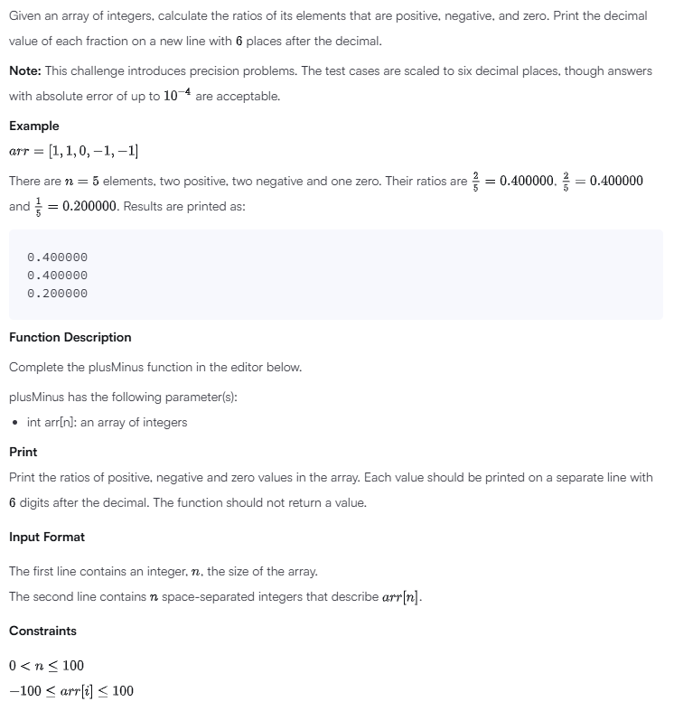
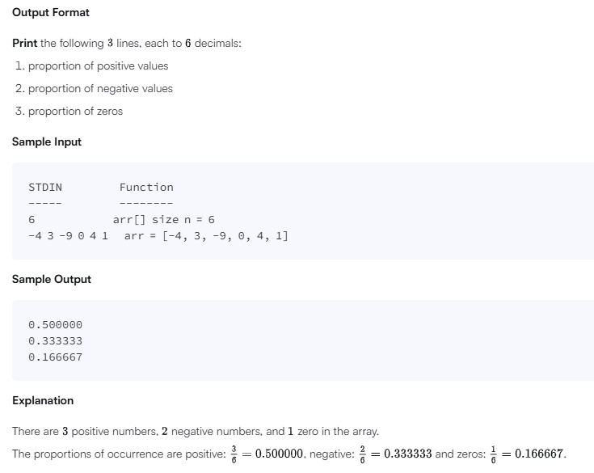

# Plus Minus

## Problem



## Solution
```
'use strict';

process.stdin.resume();
process.stdin.setEncoding('utf-8');

let inputString: string = '';
let inputLines: string[] = [];
let currentLine: number = 0;

process.stdin.on('data', function(inputStdin: string): void {
    inputString += inputStdin;
});

process.stdin.on('end', function(): void {
    inputLines = inputString.split('\n');
    inputString = '';

    main();
});

function readLine(): string {
    return inputLines[currentLine++];
}

/*
 * Complete the 'plusMinus' function below.
 *
 * The function accepts INTEGER_ARRAY arr as parameter.
 */

function plusMinus(arr: number[]): void {
    // Write your code here
    let positives = 0;
    let negatives = 0;
    let zeros = 0;
    const n = arr.length;

    for (let num of arr) {
        if (num > 0) positives++;
        else if (num < 0) negatives++;
        else zeros++;
    }

    console.log((positives / n).toFixed(6));
    console.log((negatives / n).toFixed(6));
    console.log((zeros / n).toFixed(6));
}

function main() {
    const n: number = parseInt(readLine().trim(), 10);

    const arr: number[] = readLine().replace(/\s+$/g, '').split(' ').map(arrTemp => parseInt(arrTemp, 10));

    plusMinus(arr);
}
```