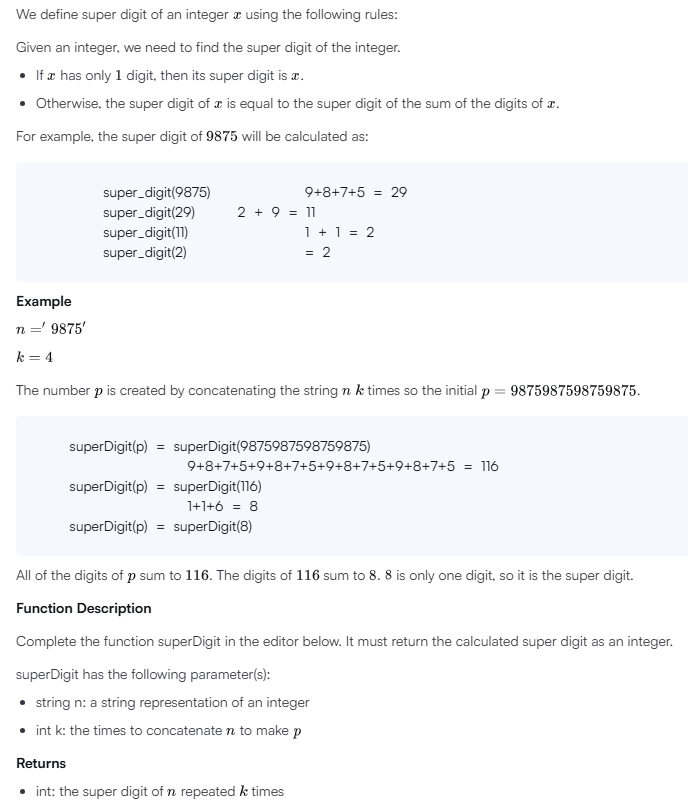
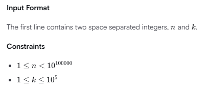

# Recursive Digit Sum

## Problem



## Solution
```
'use strict';

import { WriteStream, createWriteStream } from "fs";
process.stdin.resume();
process.stdin.setEncoding('utf-8');

let inputString: string = '';
let inputLines: string[] = [];
let currentLine: number = 0;

process.stdin.on('data', function(inputStdin: string): void {
    inputString += inputStdin;
});

process.stdin.on('end', function(): void {
    inputLines = inputString.split('\n');
    inputString = '';

    main();
});

function readLine(): string {
    return inputLines[currentLine++];
}

/*
 * Complete the 'superDigit' function below.
 *
 * The function is expected to return an INTEGER.
 * The function accepts following parameters:
 *  1. STRING n
 *  2. INTEGER k
 */

function superDigit(n: string, k: number): number {
    // Write your code here
    // Helper function to recursively calculate super digit
    function recursiveSuperDigit(numStr: string): number {
        if (numStr.length === 1) return parseInt(numStr);

        const sum = numStr.split('').reduce((acc, digit) => acc + parseInt(digit), 0);
        return recursiveSuperDigit(sum.toString());
    }

    // Step 1: Sum of digits in n
    const initialSum = n.split('').reduce((acc, digit) => acc + parseInt(digit), 0);

    // Step 2: Multiply sum by k and calculate super digit
    const total = (initialSum * k).toString();

    return recursiveSuperDigit(total);
}

function main() {
    const ws: WriteStream = createWriteStream(process.env['OUTPUT_PATH']);

    const firstMultipleInput: string[] = readLine().replace(/\s+$/g, '').split(' ');

    const n: string = firstMultipleInput[0];

    const k: number = parseInt(firstMultipleInput[1], 10);

    const result: number = superDigit(n, k);

    ws.write(result + '\n');

    ws.end();
}
```