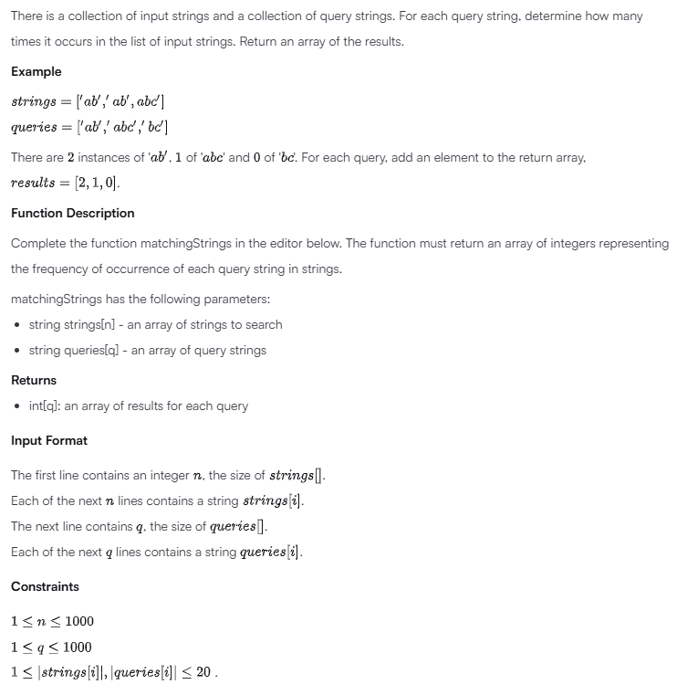
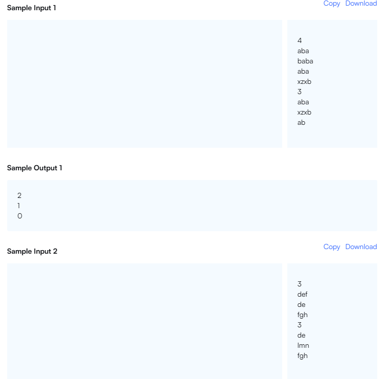
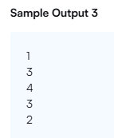

# Sparse Arrays

## Problem





## Solution
```
'use strict';

import { WriteStream, createWriteStream } from "fs";
process.stdin.resume();
process.stdin.setEncoding('utf-8');

let inputString: string = '';
let inputLines: string[] = [];
let currentLine: number = 0;

process.stdin.on('data', function(inputStdin: string): void {
    inputString += inputStdin;
});

process.stdin.on('end', function(): void {
    inputLines = inputString.split('\n');
    inputString = '';

    main();
});

function readLine(): string {
    return inputLines[currentLine++];
}

/*
 * Complete the 'matchingStrings' function below.
 *
 * The function is expected to return an INTEGER_ARRAY.
 * The function accepts following parameters:
 *  1. STRING_ARRAY strings
 *  2. STRING_ARRAY queries
 */

function matchingStrings(strings: string[], queries: string[]): number[] {
    // Write your code here
    const frequencyMap = new Map<string, number>();

    // Count occurrences of each string
    for (const str of strings) {
        frequencyMap.set(str, (frequencyMap.get(str) || 0) + 1);
    }

    // Build result array based on queries
    return queries.map(query => frequencyMap.get(query) || 0);
}

function main() {
    const ws: WriteStream = createWriteStream(process.env['OUTPUT_PATH']);

    const stringsCount: number = parseInt(readLine().trim(), 10);

    let strings: string[] = [];

    for (let i: number = 0; i < stringsCount; i++) {
        const stringsItem: string = readLine();
        strings.push(stringsItem);
    }

    const queriesCount: number = parseInt(readLine().trim(), 10);

    let queries: string[] = [];

    for (let i: number = 0; i < queriesCount; i++) {
        const queriesItem: string = readLine();
        queries.push(queriesItem);
    }

    const res: number[] = matchingStrings(strings, queries);

    ws.write(res.join('\n') + '\n');

    ws.end();
}
```