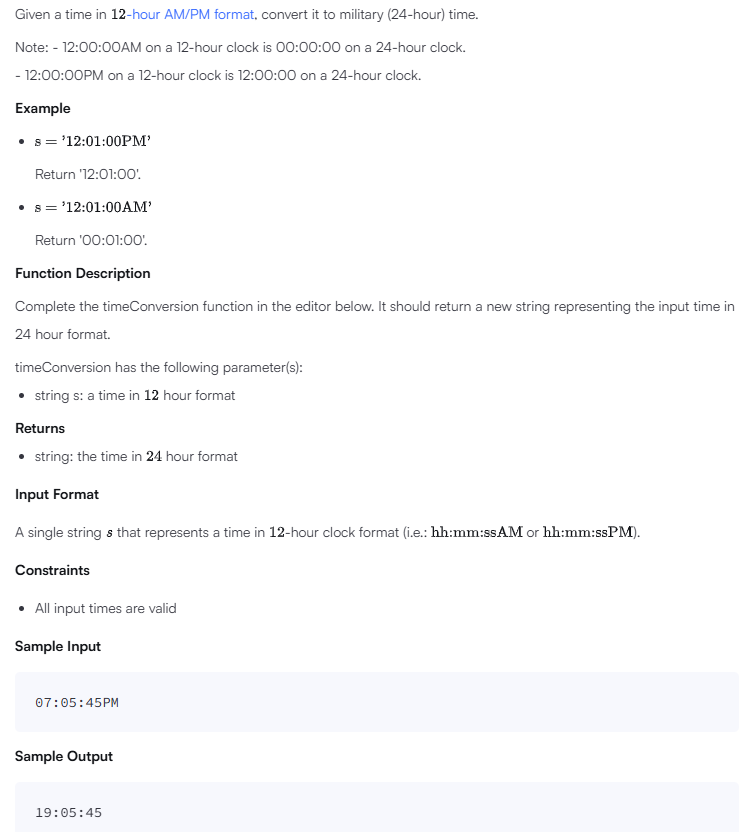

# Time Conversion

## Problem


## Solution
```
'use strict';

import { WriteStream, createWriteStream } from "fs";
process.stdin.resume();
process.stdin.setEncoding('utf-8');

let inputString: string = '';
let inputLines: string[] = [];
let currentLine: number = 0;

process.stdin.on('data', function(inputStdin: string): void {
    inputString += inputStdin;
});

process.stdin.on('end', function(): void {
    inputLines = inputString.split('\n');
    inputString = '';

    main();
});

function readLine(): string {
    return inputLines[currentLine++];
}

/*
 * Complete the 'timeConversion' function below.
 *
 * The function is expected to return a STRING.
 * The function accepts STRING s as parameter.
 */

function timeConversion(s: string): string {
    // Write your code here
    const period = s.slice(-2); // 'AM' or 'PM'
    let [hour, minute, second] = s.slice(0, 8).split(':');

    if (period === 'AM') {
        if (hour === '12') hour = '00'; // 12AM edge case
    } else {
        if (hour !== '12') hour = String(Number(hour) + 12); // Convert PM hour except 12PM
    }

    return `${hour}:${minute}:${second}`;
}

function main() {
    const ws: WriteStream = createWriteStream(process.env['OUTPUT_PATH']);

    const s: string = readLine();

    const result: string = timeConversion(s);

    ws.write(result + '\n');

    ws.end();
}
```