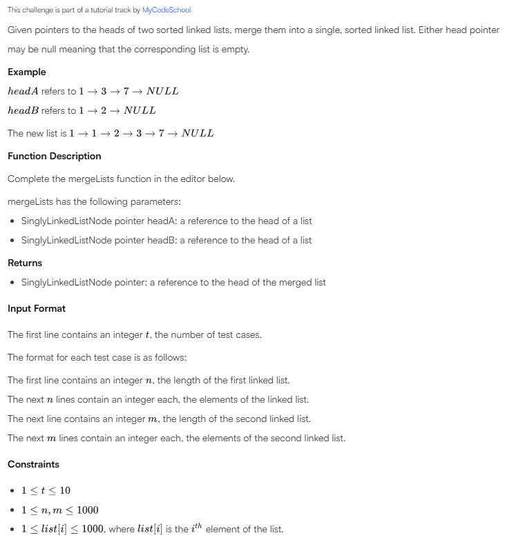
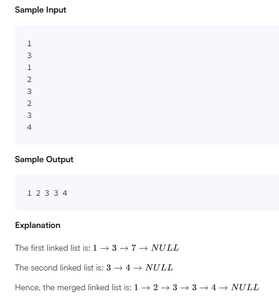

# Merge two sorted linked lists

## Problem



## Solution
```
#!/bin/python3

import math
import os
import random
import re
import sys

class SinglyLinkedListNode:
    def __init__(self, node_data):
        self.data = node_data
        self.next = None

class SinglyLinkedList:
    def __init__(self):
        self.head = None
        self.tail = None

    def insert_node(self, node_data):
        node = SinglyLinkedListNode(node_data)

        if not self.head:
            self.head = node
        else:
            self.tail.next = node


        self.tail = node

def print_singly_linked_list(node, sep, fptr):
    while node:
        fptr.write(str(node.data))

        node = node.next

        if node:
            fptr.write(sep)

# Complete the mergeLists function below.

#
# For your reference:
#
# SinglyLinkedListNode:
#     int data
#     SinglyLinkedListNode next
#
#
def mergeLists(head1, head2):
    if head1 == None:
        return head2
    if head2 == None:
        return head1
    if head1.data < head2.data:
        start = head1
        (this, other) = (head1, head2)
    else:
        start = head2
        (this, other) = (head2, head1)
    while other != None:
        if this.next != None and this.next.data < other.data:
            this = this.next
        else:
            (this.next, this) = (other, this.next)
            (this, other) = (other, this)
    return start

if __name__ == '__main__':
    fptr = open(os.environ['OUTPUT_PATH'], 'w')

    tests = int(input())

    for tests_itr in range(tests):
        llist1_count = int(input())

        llist1 = SinglyLinkedList()

        for _ in range(llist1_count):
            llist1_item = int(input())
            llist1.insert_node(llist1_item)
            
        llist2_count = int(input())

        llist2 = SinglyLinkedList()

        for _ in range(llist2_count):
            llist2_item = int(input())
            llist2.insert_node(llist2_item)

        llist3 = mergeLists(llist1.head, llist2.head)

        print_singly_linked_list(llist3, ' ', fptr)
        fptr.write('\n')

    fptr.close()
```