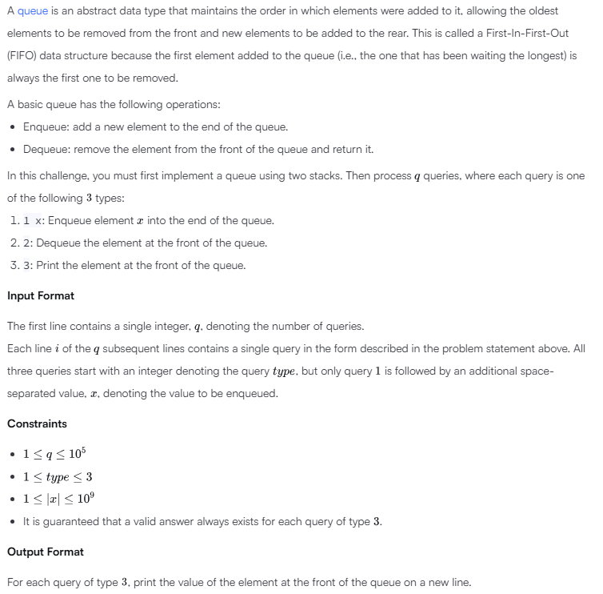
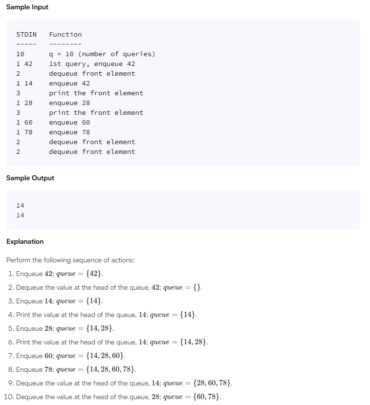

# Queue Using Two Stacks

## Problem



## Solution
```
# Enter your code here. Read input from STDIN. Print output to STDOUT
class MyQueue(object):
    def __init__(self):
        self.q1 = []
        self.q2 = []
    
    def peek(self):
        if not self.q2:
            while self.q1:
                self.q2.append(self.q1.pop())
         
        return self.q2[-1]
        
    def pop(self):
        if not self.q2:
            while self.q1:
                self.q2.append(self.q1.pop())
        
        return self.q2.pop()
        
    def put(self, value):
        self.q1.append(value)

queue = MyQueue()
t = int(input())
for line in range(t):
    values = map(int, input().split())
    values = list(values)
    if values[0] == 1:
        queue.put(values[1])        
    elif values[0] == 2:
        queue.pop()
    else:
        print(queue.peek())
```