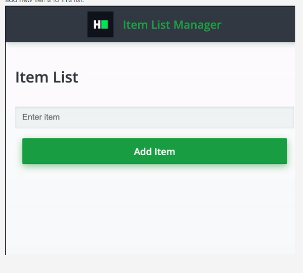

# Item List Manager

You are tasked with creating a simple React application called "Item List Manager" that displays a list of items and allows users to add new items to the list. The items will be displayed in an unordered list and there will be an input field along with a button to add new items to this list.



## Detailed Requirements

1. When the application loads. it should display an empty list.

2. The input field should accept user text input.

3. When the button is clicked:

4. The text from the input field should be added to the list.

5. The input field should be cleared.

6. If the input field is empty and the button is clicked. nothing should be added to the list.

## Sample Interaction

### Initial State

- The list is empty.

- The input field is empty.

### User Action 1

- User types "First Item" in the input field.

- User clicks "Add Item" button.

- The list displays "First Item".

### User Action 2

- User types "Second Item" in the input field.

- User clicks "Add Item" button.

- The list displays:

  - "First Item"

  - "Second Item"

## Solution

### `src/App.js`

```
import { useState } from "react";
import "h8k-components";
import "./App.css";

function App() {
  const [items, setItems] = useState([]);
  const [input, setInput] = useState("");

  const handleAddItem = () => {
	// TODO: Add logic to add input to items list
    const trimmedInput = input.trim();

    if (trimmedInput !== "") {
      setItems([...items, trimmedInput]);
      setInput("");
    }
  };

  return (
    <>
      <h8k-navbar header="Item List Manager"></h8k-navbar>
      <div className="App">
        <h3>Item List</h3>
        <input
          type="text"
          value={input}
          onChange={(e) => setInput(e.target.value)}
          placeholder="Enter item"
          data-testid="input-field"
        />
        <button onClick={handleAddItem} data-testid="add-button">
          Add Item
        </button>
        <ul data-testid="item-list">
          {items.map((item, index) => (
            <li key={index} data-testid="list-item">
              {item}
            </li>
          ))}
        </ul>
      </div>
    </>
  );
}

export default App;
```
