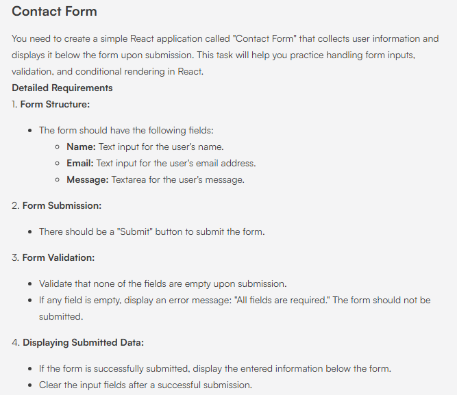
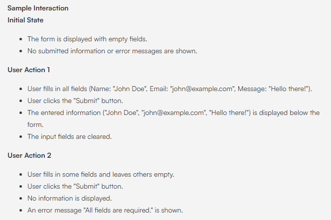

# Contact Form

## Problem



## Solution

### src/App.js
```
import { useState } from "react";
import "./App.css";

import "h8k-components";
 
function App() {
  const [name, setName] = useState("");
  const [email, setEmail] = useState("");
  const [message, setMessage] = useState("");
  const [submittedData, setSubmittedData] = useState(null);
  const [error, setError] = useState("");

  const handleSubmit = (e) => {
    e.preventDefault();
    // TODO: Add logic to validate inputs and display submitted data
    // HINT: You can use the setError function

    // HINT: You can use the setSubmittedData function as below
    // setSubmittedData({ name, email, message });
    // Validate form fields
    if (!name || !email || !message) {
      setError("All fields are required.");
      return;
    }

    // If form is valid, clear error message and submit data
    setError("");
    setSubmittedData({ name, email, message });

    // Clear form inputs after successful submission
    setName("");
    setEmail("");
    setMessage("");
  };

  return (
    <>
      <h8k-navbar header="Contact Form"></h8k-navbar>
      <div className="App">
        <h1>Contact Form</h1>
        <form onSubmit={handleSubmit}>
          <input
            type="text"
            value={name}
            onChange={(e) => setName(e.target.value)}
            placeholder="Name"
            data-testid="name-input"
          />
          <input
            type="email"
            value={email}
            onChange={(e) => setEmail(e.target.value)}
            placeholder="Email"
            data-testid="email-input"
          />
          <textarea
            value={message}
            onChange={(e) => setMessage(e.target.value)}
            placeholder="Message"
            data-testid="message-input"
          />
          <button type="submit" data-testid="submit-button">
            Submit
          </button>
        </form>
        {error && (
          <p data-testid="error-message" className="error">
            {error}
          </p>
        )}
        {submittedData && (
          <div data-testid="submitted-data" className="submitted-data">
            <h2>Submitted Information</h2>
            <p>
              <strong>Name:</strong> {submittedData.name}
            </p>
            <p>
              <strong>Email:</strong> {submittedData.email}
            </p>
            <p>
              <strong>Message:</strong> {submittedData.message}
            </p>
          </div>
        )}
      </div>
    </>
  );
}

export default App;
```